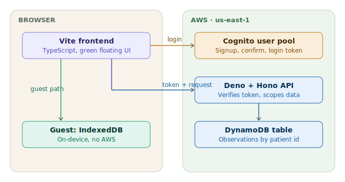

# Architecture

This document explains how the app is put together and why. For setup
instructions, see `README.md`.



The frontend picks one of two storage paths at startup. The guest path (left,
green) never touches AWS. The cloud path (right) authenticates via Cognito and
sends requests through the Deno API to DynamoDB.

## The core idea: one app, two storage backends

The defining design choice is that the app works identically whether or not AWS
is configured. A logged-in user's records go to DynamoDB; an anonymous user's
records stay in the browser. The UI, the screens, and the data shape are the
same in both cases.

This is made possible by a single storage interface that both implementations
satisfy:

```typescript
interface Storage {
  list(category?: string): Promise<Observation[]>;
  add(obs: NewObservation): Promise<Observation>;
  remove(observationId: string): Promise<void>;
}
```

- `LocalStorage` implements it over IndexedDB (guest mode).
- `CloudStorage` implements it by calling the Deno API (cloud mode).

The rest of the app only ever talks to the `Storage` interface — it never knows
which implementation is active. At startup, `config.ts` checks whether Cognito
env vars are present (`cloudAvailable()`); the login screen and `main.ts` then
pick the implementation accordingly. Adding a third backend later (say, a
different cloud provider) would mean writing one new class, not touching any
screen.

## Request flow (cloud mode)

1. The user signs up / logs in through Cognito directly from the browser
   (`auth.ts`), receiving an ID token (a JWT).
2. `CloudStorage` attaches that token as a `Bearer` header on every API call.
3. The Deno backend verifies the token against the Cognito user pool's public
   keys (`aws-jwt-verify`) and extracts the user's `sub` claim.
4. That `sub` becomes the `patientId` — the backend uses it as the DynamoDB
   partition key.

The important security property: **the client never sends the patient id.** It
comes from the verified token server-side. So a user physically cannot read or
delete another user's records, even by tampering with requests.

## Data model

Each observation is one DynamoDB item:

| Field           | Meaning                                                                       |
| --------------- | ----------------------------------------------------------------------------- |
| `patientId`     | partition key — the owner (Cognito `sub`, or a local device id in guest mode) |
| `observationId` | sort key — unique per record                                                  |
| `name`          | e.g. "Blood Pressure"                                                         |
| `category`      | e.g. "Cardiovascular" (auto-derived from the name)                            |
| `unit`          | the unit used, e.g. "mmHg"                                                    |
| `amount`        | the value entered (kept as a string so "120/80" is valid)                     |
| `createdAt`     | ISO timestamp                                                                 |

A global secondary index (`byCategory`) on `patientId` + `category` makes
"show me this patient's blood-pressure records" an efficient query rather than a
full scan.

In guest mode the same shape is stored in IndexedDB, with `patientId` set to a
randomly generated `local-…` device id held in `localStorage`.

## The observation catalog

`observations.ts` defines the known observation types — their categories and
their allowed units. This drives two UI behaviors:

- **Units come from the system.** When a type has one unit, the Add screen just
  displays it. When it has several (e.g. Blood Sugar in mg/dL or mmol/L), the
  screen shows a dropdown.
- **Category auto-selects.** Choosing an observation name looks up its category
  automatically, so the user doesn't pick it manually.

## Why these technologies

- **DynamoDB over a relational DB:** the access pattern is "all records for one
  patient, optionally by category" — a key-value pattern, not a join-heavy one.
  Pay-per-request means near-zero idle cost.
- **Cognito for auth:** managed signup, email confirmation, and JWT issuance, so
  the app never stores passwords.
- **Deno for the backend:** native TypeScript and explicit permission flags
  (`--allow-net`, `--allow-env`).
- **Vite for the frontend:** fast dev server; runs with zero config, which is
  what lets guest mode work out of the box.
- **Terraform for infra:** the AWS setup is reproducible and can be torn down
  and recreated identically.

## Known limitations

- **In-memory auth token.** The token isn't persisted, so a page refresh logs
  the user out. A production version would securely store and rehydrate the
  refresh token.
- **No guest↔cloud migration.** The two stores are independent; guest records
  don't sync up on first login. That's a deliberate-but-removable simplicity.
- **Admin-level IAM in dev.** The setup uses `AdministratorAccess` for
  convenience. A production deployment should scope the IAM permissions down to
  exactly the Cognito and DynamoDB actions needed.
